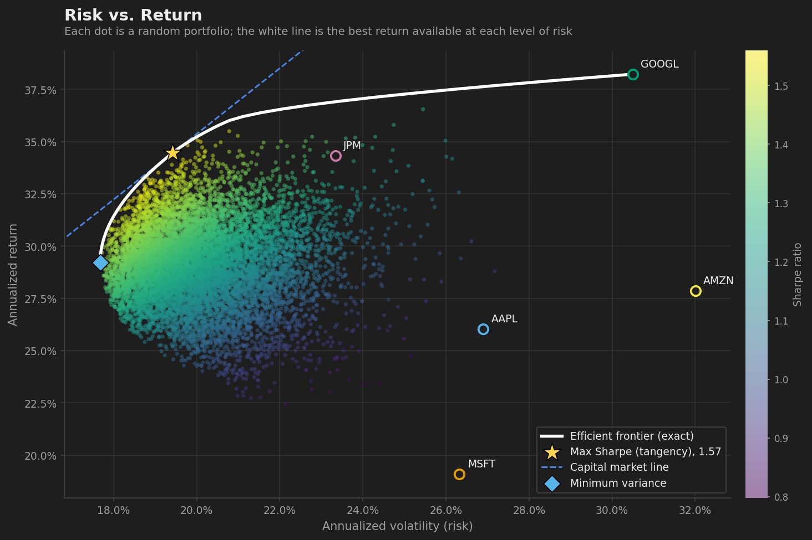
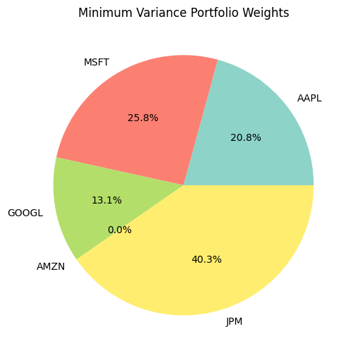
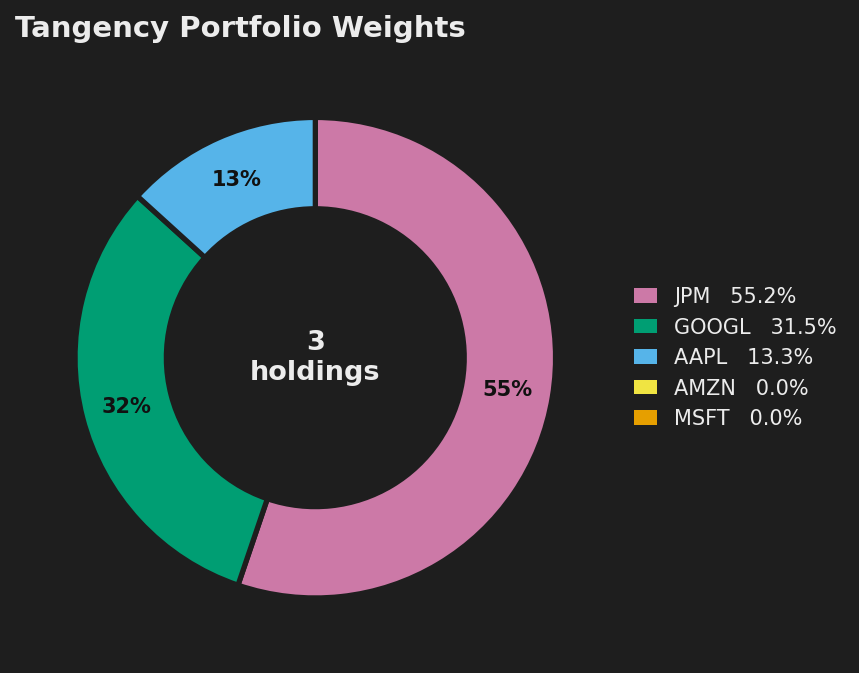
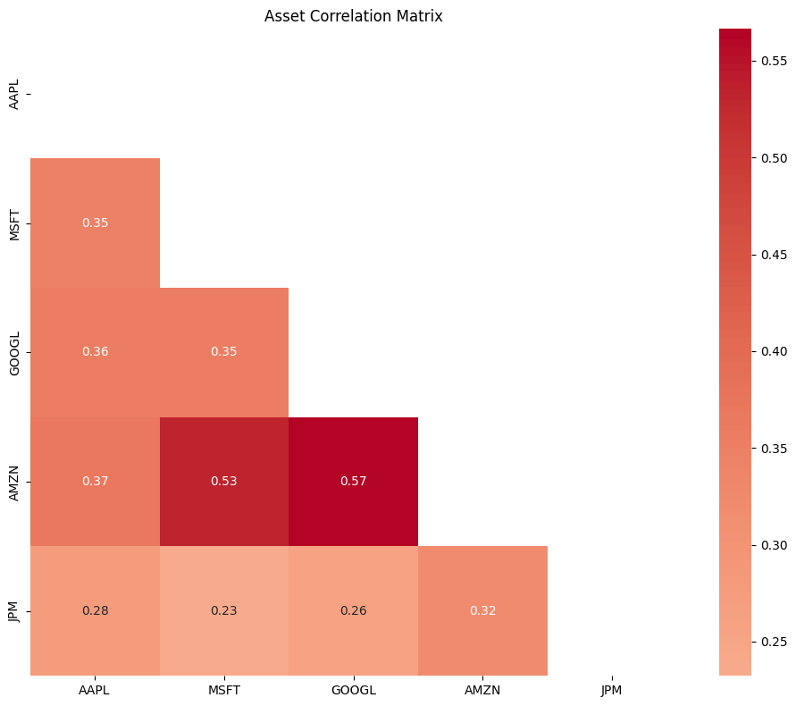
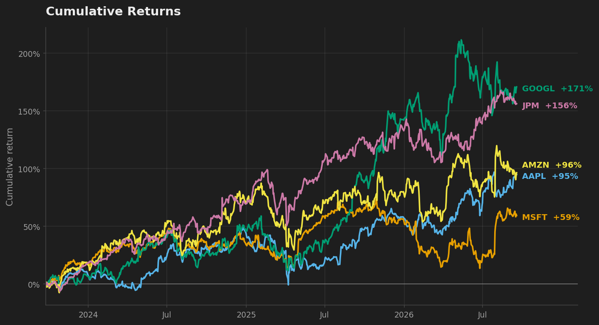
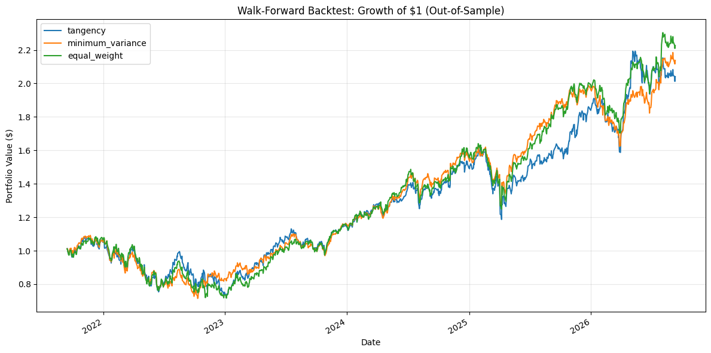

# Portfolio Optimization Application

[](https://github.com/marvinwong12/Portfolio-Optimization-Application/actions/workflows/tests.yml)

A Flask web app for mean-variance portfolio optimization, individual stock
analysis, and **walk-forward backtesting** — built to check whether the
optimization is actually doing something useful out-of-sample, not just to
draw a nice efficient-frontier scatter plot.

Each user registers an account and manages their own set of portfolios.
Given a list of tickers, the app fetches historical price data, computes
minimum-variance and tangency (max Sharpe) portfolios, runs a
Monte Carlo simulation to visualize the efficient frontier, and backtests
each strategy against a naive equal-weight benchmark.

## Screenshots

**Efficient frontier**: a cloud of random portfolios, the exact frontier, each asset, the
tangency and minimum-variance portfolios, and the capital market line:



**Minimum-variance and tangency portfolio weights:**

<p>
  
  
</p>

**Asset correlation matrix and cumulative returns:**

<p>
  
  
</p>

**Walk-forward backtest**, out-of-sample, rebalanced quarterly, net of 10 bps transaction costs,
against SPY, with a drawdown panel:



## Why the backtest matters

It's easy to build a portfolio optimizer that looks good: fit mean-variance
weights on a lookback window and show the resulting efficient frontier. The
harder — and more honest — question is whether those weights would have
actually performed well *afterward*.

The backtest module answers that by walking forward through history: at each
rebalance date it estimates weights using only the trailing 252 trading days
(never touching the period it's about to be evaluated on), trades into them,
and holds through the next 63 days with weights drifting as prices move
(true buy-and-hold). Repeating this across years of data produces a genuine
out-of-sample equity curve per strategy - net of transaction costs, and
alongside an S&P 500 (SPY) buy-and-hold benchmark, because beating
equal-weight among your own picks is a low bar.

Running it on five mega-cap stocks (AAPL, MSFT, GOOGL, AMZN, JPM) over the
last six years (1,252 out-of-sample trading days), at 10 bps per dollar
traded, gives:

| Strategy | Ann. Return | Ann. Volatility | Sharpe (95% CI) | Max Drawdown | Turnover / yr |
|---|---|---|---|---|---|
| Tangency (max Sharpe) | 15.5% | 25.0% | 0.46 [-0.38, 1.53] | -33.0% | 136% |
| Minimum Variance | 16.1% | 20.5% | 0.59 [-0.27, 1.67] | -35.3% | 40% |
| Equal Weight | 17.5% | 22.7% | 0.60 [-0.27, 1.74] | -34.0% | 13% |
| SPY (Buy & Hold) | 13.3% | 17.2% | 0.54 [-0.30, 1.60] | -24.5% | 0% |

**The honest reading is that none of these differences is statistically
real.** A point estimate says equal-weight edges minimum variance, which edges
the S&P 500, which edges tangency - but the confidence intervals (a paired
block bootstrap, 21-day blocks so volatility clustering is preserved, 2,000
resamples) tell a different story. Every strategy's Sharpe interval spans
roughly -0.3 to +1.7, and every pairwise difference's interval includes zero
(for example, Tangency vs. Equal Weight: -0.13, 95% CI [-0.62, +0.29], a 27%
chance of being better). Five years of daily data simply isn't enough to rank
these portfolios.

What the data *does* support is narrower. The mean-variance optimizers did not
demonstrably beat a naive equal-weight portfolio - consistent with the
estimation-error problem in mean-variance optimization (Michaud's "error
maximization"): with few assets and noisy return estimates, the optimizer
chases sampling noise that doesn't persist out-of-sample. And costs punish the
strategy that trades most: tangency turns over 136% of the portfolio a year, so
even 10 bps costs it about 0.4 points of annual return, versus almost nothing
for equal weight. SPY delivered the lowest return but also the lowest
volatility and drawdown, for a risk-adjusted result indistinguishable from the
rest. Surfacing this kind of result - rather than only ever showing a
favorable point estimate - is the whole point of validating out-of-sample.

That "no significant difference" result is itself a consequence of the five
picks being correlated mega-cap tech (pairwise correlation 0.23-0.56) - there's
limited diversification for an optimizer to exploit. Re-running the identical
methodology on a genuinely diversified basket (SPY, BND, GLD, VNQ - stocks,
bonds, gold, REITs; pairwise correlation 0.16-0.66) surfaces a result that
*is* statistically significant:

| Strategy | Ann. Return | Ann. Volatility | Sharpe (95% CI) | Max Drawdown | Turnover / yr |
|---|---|---|---|---|---|
| Tangency (max Sharpe) | 12.8% | 15.4% | 0.57 [-0.31, 1.58] | -25.4% | 97% |
| Minimum Variance | 2.7% | 6.4% | -0.20 [-1.07, 0.78] | -18.1% | 22% |
| Equal Weight | 8.7% | 10.9% | 0.43 [-0.45, 1.45] | -21.0% | 8% |
| SPY (Buy & Hold) | 13.4% | 17.2% | 0.54 [-0.25, 1.57] | -24.5% | 0% |

Minimum Variance's Sharpe ratio is significantly *worse* than Equal Weight's:
ΔSharpe -0.63, 95% CI [-1.15, -0.15] - the interval excludes zero, and this
holds at 0, 10, and 25 bps of transaction cost, so it isn't a cost artifact.
By leaning heavily into the lowest-volatility asset (bonds), the
minimum-variance objective did exactly what it was asked to do - it achieved
the lowest volatility (6.4%) and the shallowest drawdown (-18.1%) of any
strategy - but gave up enough return in the process (2.7% annualized, versus
8.7% for equal weight) that its risk-adjusted return came out significantly
worse, not better. That's the opposite of what "minimum variance" intuitively
promises, and it's only visible because the comparison is bootstrapped rather
than read off a single point estimate.

## Features

- **Portfolio optimization**: minimum-variance and tangency (max Sharpe)
  portfolios using Ledoit-Wolf shrinkage covariance estimation; long-short
  via closed form, long-only via a bounded optimization (SLSQP) - clipping a
  closed-form solution's negative weights isn't the true long-only optimum
- **Efficient frontier visualization**: a Monte Carlo cloud (vectorized
  NumPy, not a Python loop) overlaid with the *exact* frontier curve, solved
  via constrained optimization (`scipy.optimize`, SLSQP) rather than sampled
  - which also supports an optional per-asset weight cap that the
  closed-form tangency/min-variance solutions can't express
- **Walk-forward backtesting** of each strategy's realized, out-of-sample
  performance, net of an adjustable transaction cost, against equal-weight and
  an S&P 500 (SPY) buy-and-hold benchmark - with block-bootstrap confidence
  intervals on every Sharpe ratio and on each difference, so you can see
  whether a gap is real or noise
- **Weight history**: every `/access` run records a snapshot of each
  strategy's weights, so `/history/<id>` can chart how the "optimal"
  allocation actually drifted across runs instead of only showing the
  latest one
- **Risk-adjusted performance metrics**: Sharpe ratio, Treynor ratio, beta,
  and Jensen's alpha against a market benchmark (SPY)
- **Charts built to be read**: a dark theme that matches the UI, a
  colorblind-safe palette with each asset and strategy keeping one color
  throughout, direct labels instead of legends, a drawdown panel under the
  backtest, and the individual assets plotted against the frontier - all
  rendered on thread-safe matplotlib `Figure` objects, since the deployed
  server is threaded
- **Portfolio-level risk analysis**: historical 1-day VaR and CVaR (95%), max
  drawdown, and each asset's share of total portfolio variance versus its
  weight - e.g. a 42% position that is really 60% of the risk
- **Individual stock analysis**: valuation ratios, profitability metrics,
  technical indicators (RSI, MACD, Bollinger Bands), dividend analysis, and
  a simplified DCF valuation
- **Per-user accounts**: each user registers, logs in, and only ever sees
  and manages their own portfolios - plus a one-click **Try Demo** login
  (`flask seed-demo-user`) for exploring without registering
- **Caching**: a TTL cache in front of the Yahoo Finance API, tracking real
  hit/miss counts rather than assuming an effect - measured at an 80% hit
  rate for 5 repeat views of the same portfolio (4 of 5 batched price fetches
  and 4 of 5 risk-free-rate fetches avoided), cutting fetch time from ~540ms
  to under 1ms for a cached view
- **CSRF protection** on every state-changing request (Flask-WTF), and a
  hardened `SECRET_KEY` requirement outside debug/testing mode

## Architecture

The Flask app is a thin entry point over the `portfolio_optimizer` package,
split by responsibility so the quantitative core has zero web/DB
dependencies and can be unit-tested in isolation:

```
app.py                    # Entry point: app = create_app()
portfolio_optimizer/
├── __init__.py           # App factory (create_app), extension wiring
├── auth.py               # Register / login / logout (Flask-Login)
├── models.py             # User, Portfolios (SQLAlchemy)
├── routes.py             # Flask routes / ownership enforcement
├── data_fetcher.py       # Yahoo Finance fetching + caching
├── cache.py              # TTL cache
├── analyzer.py           # Mean-variance math (pure NumPy/pandas)
├── backtest.py           # Walk-forward backtest engine
├── visualizer.py         # Matplotlib chart rendering
├── portfolio_service.py  # Orchestrates fetch -> analyze -> store
└── stock_analysis.py     # Single-stock fundamental/technical analysis
migrations/               # Alembic schema migrations (Flask-Migrate)
tests/                    # pytest suite (274 tests)
```

## Tech stack

Flask, Flask-SQLAlchemy, Flask-Login, Flask-Migrate (Alembic), Flask-WTF
(CSRF protection), SQLite, [yfinance](https://github.com/ranaroussi/yfinance),
NumPy, pandas, scikit-learn (Ledoit-Wolf covariance shrinkage),
matplotlib/seaborn, pytest.

## Getting started

```bash
git clone https://github.com/marvinwong12/Portfolio-Optimization-Application.git
cd Portfolio-Optimization-Application

python3 -m venv .venv
source .venv/bin/activate       # .venv\Scripts\activate on Windows
pip install -r requirements.txt

export FLASK_APP=app.py
export SECRET_KEY=$(python -c 'import secrets; print(secrets.token_hex(32))')
flask db upgrade                # create/update the database schema
flask seed-demo-user            # optional: seeds a one-click "Try Demo" account

python app.py                   # http://127.0.0.1:5000
```

`SECRET_KEY` signs session cookies and CSRF tokens, so the app refuses to
start without one outside of debug/testing mode - generate it once and keep
it somewhere durable (not just your shell history) for a real deployment.
Alternatively, set `FLASK_DEBUG=1` for pure local development to skip this
(uses a fixed, clearly-insecure dev key instead).

Register an account, add a portfolio (a comma-separated list of tickers),
then use **Access** to run the optimization or **Backtest** to walk it
forward through history. Or click **Try Demo** on the login page to skip
registration and explore two pre-loaded sample portfolios immediately.

## Running tests

```bash
pip install -r requirements-dev.txt
pytest -v                                              # 274 tests
pytest --cov=portfolio_optimizer --cov-report=term-missing   # 93% line coverage
```

274 tests (93% line coverage on the `portfolio_optimizer` package) cover the
optimization math (including regression tests for a handful of real bugs
found along the way — a tangency-weight sign flip, a risk-free-rate unit
mismatch, a `None` dividend yield crash), the exact efficient frontier
(bounds, monotonicity, dominated-region exclusion), the backtest engine's
no-lookahead guarantee, transaction-cost accounting and bootstrap coverage
(validated at ≥85% empirical coverage against a known ground-truth Sharpe
ratio across 150 simulated trials), chart rendering (including concurrent
renders), weight-history snapshot persistence, cache hit-rate accounting,
per-user access control, and CSRF protection (verified end-to-end with it
explicitly turned back on), all with `yfinance` mocked so the suite runs
fully offline.

## Deploying to Render (free tier)

`render.yaml` describes the service. If you set it up by hand in the dashboard instead, use:

- **Build command:** `pip install -r requirements.txt`
- **Start command:** `flask db upgrade && flask seed-demo-user && gunicorn app:app --workers 1 --threads 4 --timeout 120`
- **Environment variables:** `SECRET_KEY` (required - the app refuses to boot without it), `FLASK_APP=app.py`, `PYTHON_VERSION=3.13.5`

The free tier's filesystem is ephemeral, so the SQLite database (registered users, saved
portfolios) resets on every deploy and after each idle spin-down. The start command re-creates
the schema and the **Try Demo** account on every boot, so the demo always works; for durable
user data, attach a persistent disk or switch to Render Postgres.
